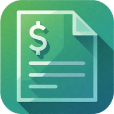
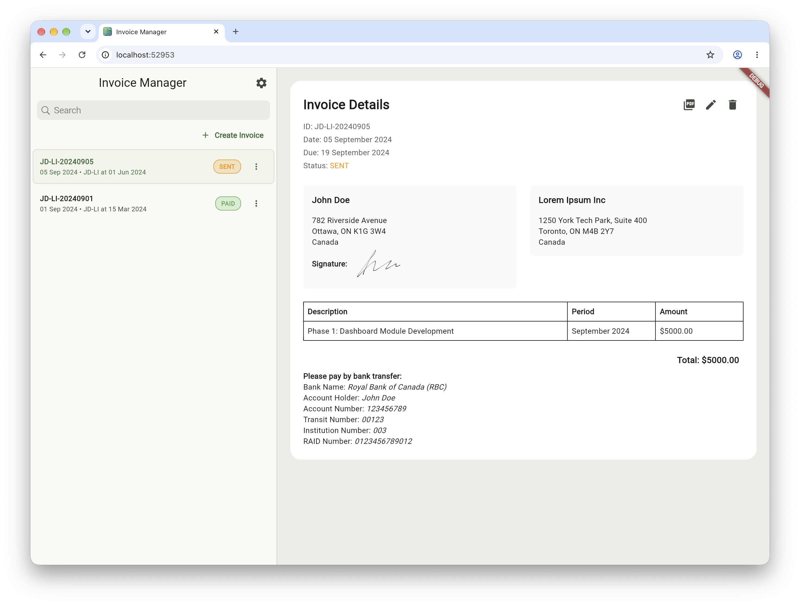
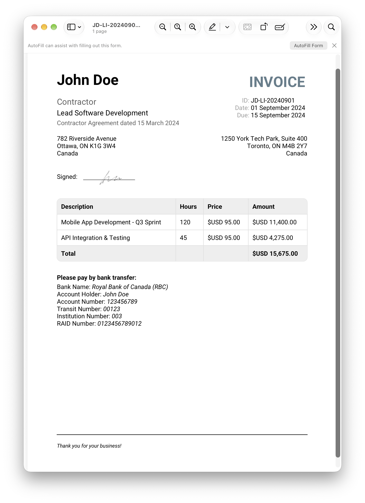
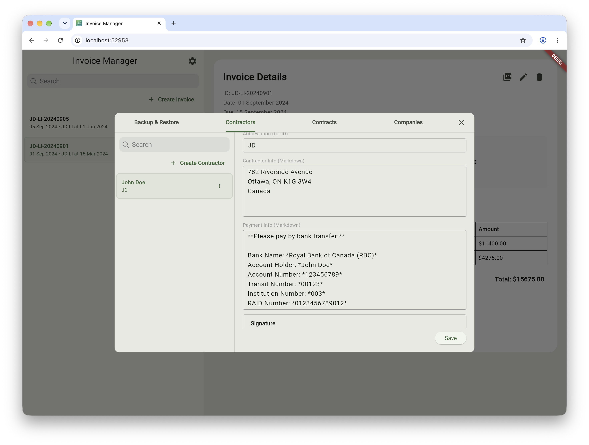

#  Invoice Manager

Simple invoice management app that works locally in your browser. For freelancers, independent
contractors, and professionals working
on contract.

- No tracking
- No ads
- No account / registration - all in your browser

---

## 📸 Screenshots





---

## ✨ Features

### Core

- **Create invoices** - Quick creation with form validation
- **Search & filter** - Instant search across all invoices
- **Status tracking** - Draft, Sent, Paid, Cancelled with visual indicators
- **PDF export** - Professional PDFs with full details
- **Dark mode** - for comfortable working
- **Duplicate invoices** - Copy existing invoices to use as templates
- **Backup / Restore** - Can export to ZIP archive, and then import it back

### Data Models

- **Contractors** - Contractor info (full name, abbreviation, bank details)
- **Companies** - Client/company data
- **Contracts** - Work agreements with hourly or fixed-rate settings

### Two Invoice Modes

1. **Hourly** - Rate × quantity with hours/days labels
2. **Fixed** - Fixed amount per milestone/phase

---

## 🔒 Snapshots & History

**Important:** When creating an invoice, Contractor, Company, and Contract data are saved as a
snapshot inside the Invoice.

This means:

- ✅ Old invoices can be regenerated to PDF even after Contractor/Company/Contract changes
- ✅ Actual data at the time of invoicing is always preserved
- ✅ No discrepancies between old and new invoices

**Sync:**
If you need to update an invoice with current Contractor/Company/Contract data - use the sync
button (updates the snapshot).

---

## 📋 PDF Template

Currently using one PDF template (see screenshot above).

**Customizable:**

- Almost all text in the template
- Field labels and names
- Multilingual support for date format (but always `YYYY MMM DD`)

---

## 🚀 Quick Start

### Installation

```bash
git clone https://github.com/yourusername/invoice_manager.git
cd invoice_manager
flutter pub get
flutter pub run build_runner build --delete-conflicting-outputs
flutter run -d chrome
```

### First Run

1. **Demo data** (optional) - load sample data from Settings
2. **Create Contractor** - your info as a contractor
3. **Create Company** - client/company
4. **Create Contract** - work terms (hourly or fixed)
5. **Create Invoice** - add line items and export PDF

---

## 💾 Import / Export

**Why this matters:** Data is stored in local database (IndexedDB) inside the browser.

### Export

- Settings → Export Data
- Downloads ZIP with full backup

### Import

- Settings → Import Data
- Restores data from ZIP
- ⚠️ **Warning:** replaces all current data!

**What gets exported:**

- Contractors, Companies, Contracts, Invoices

---

## 📦 ZIP Export

The app supports data import/export via ZIP archive:

- All data encoded in storable format
- ZIP created via `archive` package
- Includes all entities and relationships
- Import validates data integrity

---

## 💻 Tech Stack

| Technology | Description       |
|------------|-------------------|
| Flutter    | UI framework      |
| Drift      | SQLite database   |
| Provider   | State management  |
| PDF        | PDF generation    |
| Archive    | ZIP import/export |

---

## 📝 Data Structure

```
Contractor ──┐
             ├─── Contract ─── Invoice (with data snapshot)
Company ─────┘
```

---

## 👨‍💻 Author

Built with Flutter for freelancers and contractors.

**By Aleksey Garbarev and local Qwen3.5 LLM**

---

**Simple. Effective. For work.**
